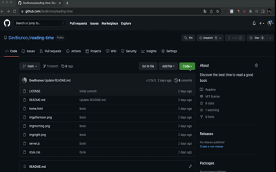

<h1 style="color: rgb(245, 119, 140);">NavRose is a mini project</h1>
<h3>A small project that mainly constitutes</h3>
<ul>
    <li>Boststrap 4.1 Navbar Model</li>
    <li>Modern and responsive in a practical way</li>
    <li>Compatible and adaptable for all screen sizes</li>
    <li>Minamilist with a beautiful design</li>
</ul>
 
 
<h2><q>To see the work, download the zip repository, and then move the html document to your navigation bar</q></h2>
